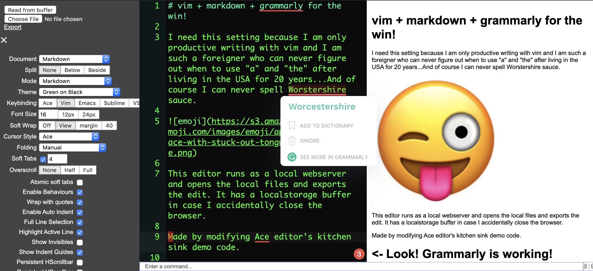

# Ace editor + Grammarly

This editor is intended to run as a local webserver.



## Motivation

I cannot write grammatically correct English without [Grammarly](http://grammarly.com/). It has been a major drawback for me not being able to use the service outside the browser and Grammarly app because I really want to stick to my favorite text editor such as Vim when I type anything. I also love markdown. So I modified [Ace editor](https://github.com/ajaxorg/ace)'s kitchen sink demo code to make it work with Grammarly and combined the markdown preview panel.

## How to run

With Python for example,

```
python -m SimpleHTTPServer 4000
```

And point the browser to http://localhost:4000

On the browser,

1. Click on "Choose File" on the top-left to open a local file.
2. Choose Markdown mode to use the Markdown preview window on the right.
3. With Vim keybinding, ":w" to update the markdown preview. This also updates the localstorage buffer.
4. When you accidentally close the browser, don't panic. Just click on "Read from buffer" button on the top-left for the recovery.
5. Click on "Export" link under "Choose File" button to download the current snapshot.

## Do more with bin/ace script

At the root of this repository,

```
bin/ace <browswer's default download directory> <destination> <file extention>
```

For example,

```
bin/ace ~/Download ~/my_blog/ md
```

In the above case, the process monitors Download folder for .md (markdown) files. (left-)Clicking on Export link will cause the browser to download the current editor buffer. If the file is `<some name>.md`, the process automatically moves the file to `~/my_blog` directory. (tested on OS X)

The folder `~/my_blog` is also considered as the HTML root. When `bin/ace` starts, it will create a symlink of the HTML root directory with the name `html_root` at the root of the repository folder. The HTML preview in the editor automatically add `html_root/` to the internal hyperlink and the image tags so the images and the links appear correctly in the preview window.

## Important notes and limitations:

- This editor is a quick and dirty hack by modifying the kitchen sink demo code of Ace editor. Use it at your own peril.
- Grammarly fails to check the entire text when Ace editor's Folding is on. Try turning it off (= manual) from the settings on the side menu on the left.
- Soft wrap also seems to confuse Grammarly. Keep it as "margin"
- When Grammarly suggests changes, you can hover the cursor to reveal the details, but don't click to use the automatic replacement. It won't persist on the editor. Edit manually.

Below is the original README from the forked source code.

Ace (Ajax.org Cloud9 Editor)
============================
[](https://cdnjs.com/libraries/ace)
[](https://www.npmjs.com/package/ace-builds)

Ace is a code editor written in JavaScript.

This repository has only generated files.
If you want to work on ace please go to https://github.com/ajaxorg/ace instead.


here you can find pre-built files for convenience of embedding.
it contains 4 versions
 * [src](https://github.com/ajaxorg/ace-builds/tree/master/src)              concatenated but not minified
 * [src-min](https://github.com/ajaxorg/ace-builds/tree/master/src-min)      concatenated and minified with uglify.js
 * [src-noconflict](https://github.com/ajaxorg/ace-builds/tree/master/src-noconflict)      uses ace.require instead of require
 * [src-min-noconflict](https://github.com/ajaxorg/ace-builds/tree/master/src-min-noconflict)      concatenated, minified with uglify.js, and uses ace.require instead of require


For a simple way of embedding ace into webpage see [editor.html](https://github.com/ajaxorg/ace-builds/blob/master/editor.html) or list of other [simple examples](https://github.com/ajaxorg/ace-builds/tree/master/demo)
To see ace in action go to [kitchen-sink-demo](http://ajaxorg.github.com/ace-builds/kitchen-sink.html), [scrollable-page-demo](http://ajaxorg.github.com/ace-builds/demo/scrollable-page.html) or [minimal demo](http://ajaxorg.github.com/ace-builds/editor.html),


